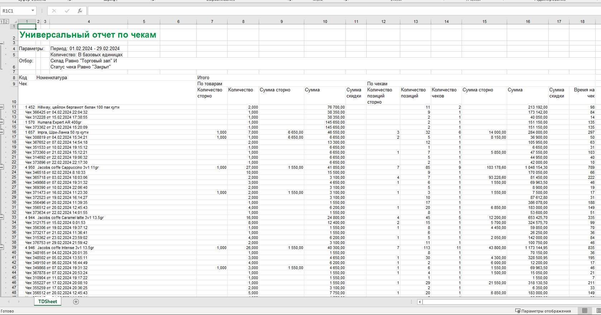
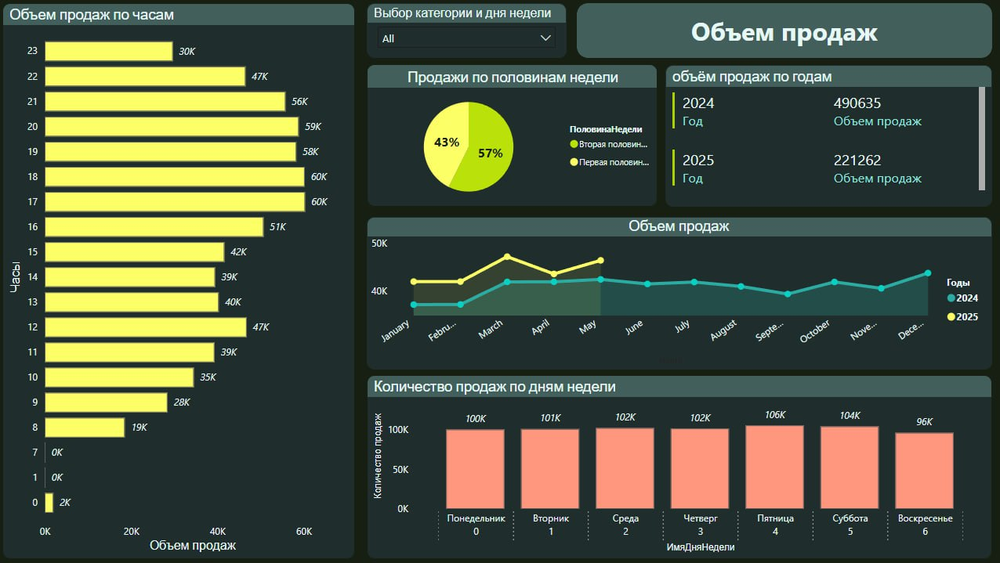
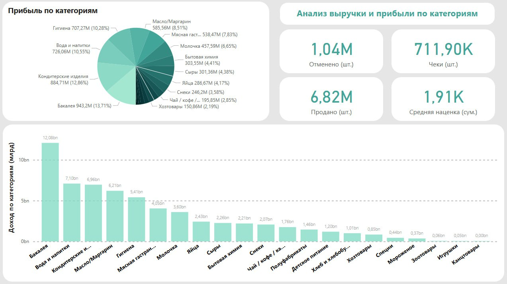
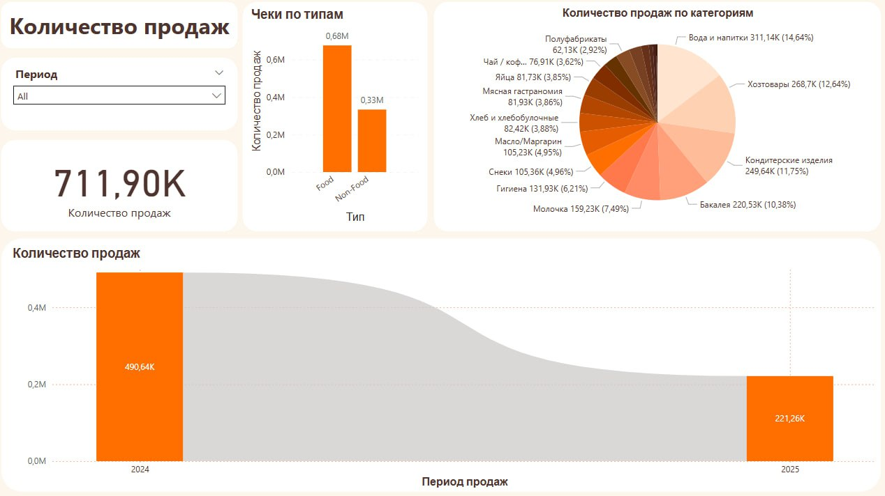
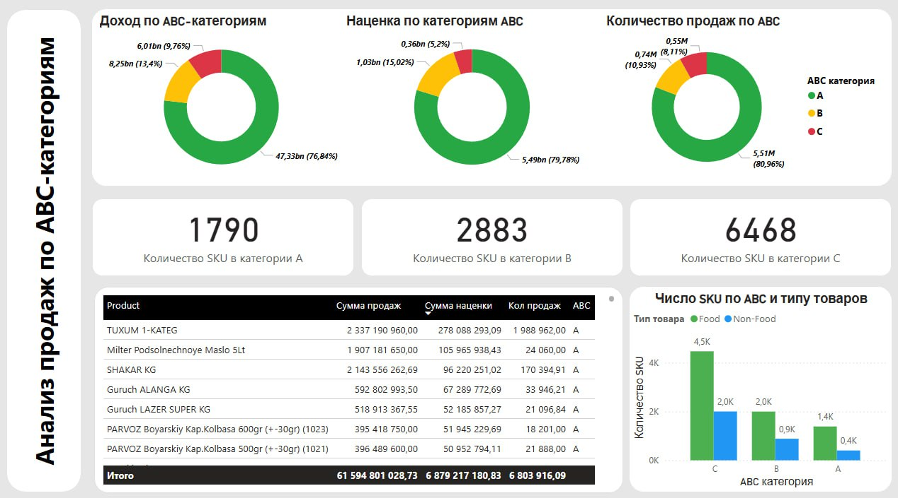

# Retail-analysis
Analyzing retail sales data to uncover demand patterns, product performance, and sales stability across SKUs.

# Project Overview

This project transforms raw Excel data into interactive dashboards for business analysis and strategic decision-making. It is designed to handle large datasets, clean and process data, and present actionable insights on sales, revenue, and product performance across different categories.

**Key Tools and Techniques:**
- **Excel** – initial data collection, organization, and preliminary analysis  
- **Pandas** – data cleaning, manipulation, aggregation, and preparation for visualization  
- **NumPy** – numerical computations and advanced array operations  
- **Matplotlib & Seaborn** – creating charts, graphs, and visualizations for dashboards  
- **Streamlit / Plotly** – building interactive and user-friendly dashboards  
- **ABC & XYZ Analysis** – classifying products based on revenue contribution and sales stability  
- **Statistics** – trend analysis, KPI calculations, and performance evaluation  
- **Data Modeling & Transformation** – handling missing values, normalization, and data summarization  
- **Business Insights** – interpreting results to guide inventory, sales, and pricing strategies  

The dashboards provide a comprehensive view of sales volume, revenue, profit distribution, product category performance, and SKU-level analysis, enabling stakeholders to make data-driven decisions efficiently.
## Project Workflow

This project transforms raw Excel data into an interactive dashboard for data analysis and visualization.

### From Excel File

The project begins with raw Excel data containing records, metrics, and business-related information. The data is cleaned, processed, and prepared for analysis using Python libraries.

### To Interactive Dashboard

This image presents the interactive dashboard created from the processed Excel dataset. It includes key metrics, charts, filters, and summarized insights to help users analyze performance, identify trends, and explore patterns efficiently. The dashboard provides a clear and organized view of the data, making it easier to support decision-making and monitor important business indicators.

### Revenue and Profit Analysis Dashboard

This image presents a dashboard focused on revenue and profit analysis by category. It includes category-level profit distribution, total sales metrics, average markup, number of checks, and product sales volume. The dashboard also highlights the contribution of each category to overall revenue, helping users identify the most profitable products and business segments.

---

### Sales Volume Dashboard

This image displays a sales volume dashboard with category-based sales distribution, sales type comparison, yearly sales trends, and overall sales quantity. It allows users to analyze changes in sales performance across different periods, compare food and non-food sales, and identify the categories with the highest sales contribution.

### ABC Category Sales Analysis Dashboard

This screenshot presents a dashboard for analyzing sales by ABC categories. It includes revenue, markup, and sales quantity distribution across categories A, B, and C. The dashboard also provides the number of SKUs per category and a detailed table of products with sales sum, markup, and quantity sold. Additionally, it visualizes SKU distribution by product type (Food and Non-Food), allowing users to identify high-performing products and prioritize inventory and sales strategies effectively.
